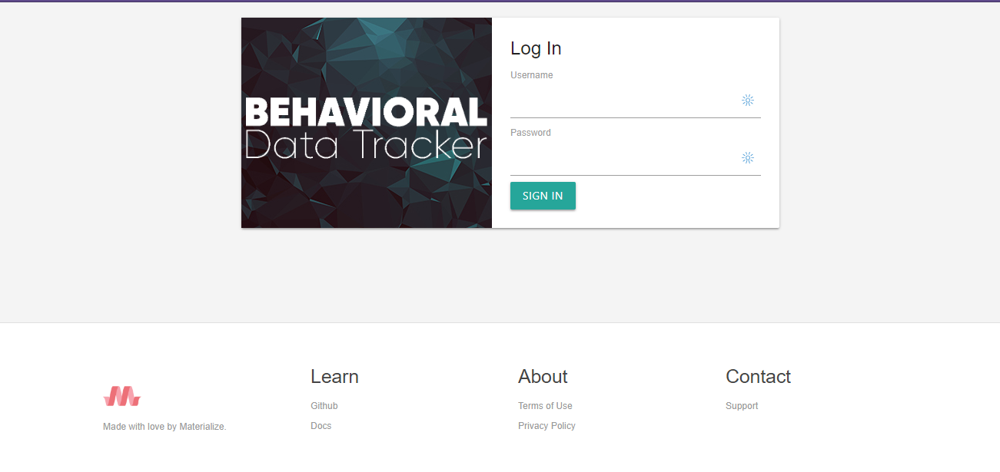
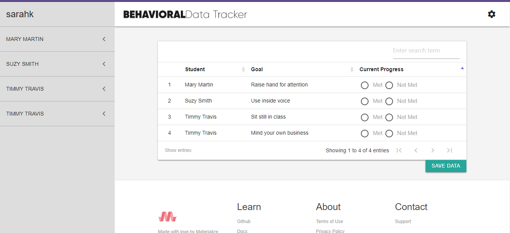
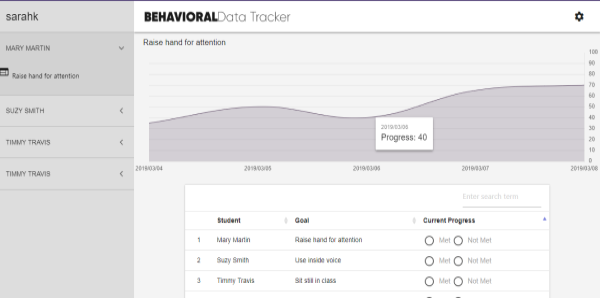

# Behavioral Data Tracker v.2 (MySQL Express App Phase)
A Behavioral Tracking Application for whole-interval recording, designed for ease of use and to reduce redundant data entry in many classroom behavioral tracking systems. This application collects data and updates charts in real time to display behavioral trends to help professionals evaluate the effectiveness of behavioral interventions.  Although the app was specifically designed for use with students with severe emotional/behavioral disabilities requiring frequent behavioral monitoring, it can be used by teachers serving any population of students.  Please note that this is a prototype for further development incorporating fictitious data and utilizes minimal security measures to protect student data.  Please do NOT use this version to store any real student data.  The developers are not responsible for the misuse of this application.

## Developed by: Sarah Kinneer, Billy Sterling, and Jodi Woodard
## March, 2019

### Login Page

### Teacher Dashboard

### Behavior Graph

## Technologies Used:
HTML5, CSS3, Materialize, JavaScript, jQuery, MySQL, Sequelize, Express, Chart, Passport, Moment, bCrypt

## Link to Live Site:
- [Log some (fictional) data!](https://thawing-dawn-54915.herokuapp.com/) - Head to the live site and login with the demo username 'sarahk' and password 'a'!

## To Use the Live Site:
- Sign in with your user id and password. You may view a demo site with the username 'sarahk' and the extra-super-secure password 'a'.
- Since 'sarahk' is a staff member, you will see her dashboard page with several make-believe student goals ready for rating.
- Feel free to enter data by selecting radio buttons telling whether or not each student met their behavior goals during a rating interval and clicking the 'SAVE DATA' button.  This saves a rating instance to the database.  It is up to the team working with each student to determine rating intervals.  Not all students necessarily need to be rated at each interval (the app is designed to handle null/undefined inputs).
- Click on a student name in the left navigation pane and then the behavioral goal to view that student's behavioral progress over time. These charts show the average percentage of intervals the identified goal was met each day.
- Note: The charts on this prototype application are hard-coded because the team determined that we will use a different database in the next phase. Therefore, we decided to discontinue development of the old database in order to focus on phase 3.

## Future Development:
- There are plans to develop this application further, including adding student/parent and admin interfaces as well as additional behavioral monitoring features (such as student self-monitoring, frequency counts, duration recording, random instance recording, etc.).  We also plan to add additional security measures to ensure that student data is protected per FERPA and COPPA regulations.

## Sources:
Admin template adapted from Materialize
